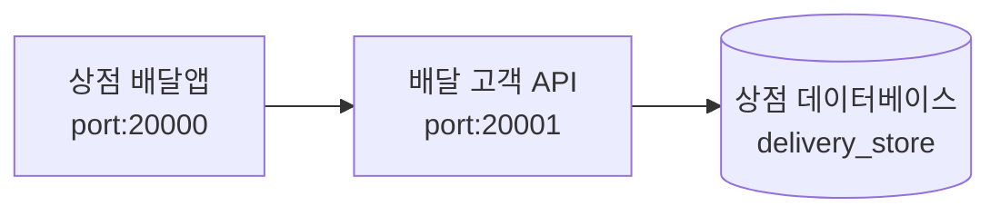

# '상점용 앱' 프로젝트
- 배달 상점에서 사용하는 서비스, 상점의 주문 관리를 위한 앱
- Role: **`delivery-store-app`**
- Port: **`20000`**

# Tech Stack
- Spring Boot 3
- JPA
- jQuery
- Thymeleaf
- Admin LTE

# 시스템 구성과 흐름

# 접속 URL
- 홈: http://localhost:20000/
- 주문목록: http://localhost:20000/orders?requestStoreOrderStatus=READY&storeId=7&queryBaseDate=2023-12-17

# 초기 계정
- ID: test@test.com
- PW: 1111